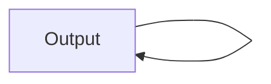

# Bronze
Bronze架构于Apache SparkMllib之上的机器学习平台，提供数据接入，转换，训练，测试

-----

### Bronze 支持的插件

- Input Plugin

Fake, File, HDFS

- Transform Plugin
   ##### 通用转换器
   - Filter *过滤*
   - Schema *给输入数据集增加schema*
   - Sql *通过sql方式操作数据集*
   - LabeledPoint *生成标注点*
   ##### 高级转换器
   - RFormula *允许在声明式语言指定转换*
   - VectorAssembler *将所有特征组合成一个大的向量*   
   - SQLTransformer *使用sql的方式对数据做转换，不需要是要表名，而是使用关键字__THIS__*
   ##### 处理连续特征
   - Bucketizer *基于硬编码分桶*
   - QuantileDiscretizer *基于数据百分比分桶*
   - StandardScaler *将一组特征值归一化为平均值为0而标准偏差为1的一组新值*
   - MinMaxScaler *基于给定的最小值到最大值按比例缩放*
   - MaxAbsScaler *将每个值除以该特征的最大绝对值来缩放数据*
   - ElementwiseProduct *用一个缩放向量对某向量中的每个值以不同的尺度进行缩放*
   - Normalizer *使用某个幂范数来缩放多维向量*
   - StringIndexer *将字符串映射到不同的数字id*
   ##### 文本数据转换器
   - Tokenizer *文本分词*
   - StopWordRemover *删除常用词*
   

- Machine learning Plugin

LinearRegression, LogisticRegression

- Output Plugin

Stdout

### 环境依赖
1. Java运行环境，JDK Version >= 8
2. 如果要在集群环境中运行
    - Spark on Yarn